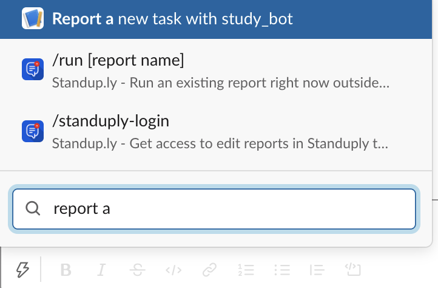

# ts-workflow-bot
Create Jira tasks via  Slack shortcuts

## Setup

### Create a Slack App

1. Create an app at api.slack.com/apps
2. Navigate to the OAuth & Permissions page and add the following scopes to User Token Scopes:
    - identity.basic
    - identity.email

### Setup local environment
1. Clone the code
2. Create .env.local
JIRA_USER = "test@example.com:test_api_token"

- [How to manage Jira api tokens?](https://support.atlassian.com/atlassian-account/docs/manage-api-tokens-for-your-atlassian-account/)

3. Install dependencies and run app in local
```
$ npm install
$ npx tsc -w
$ npm start
```

4. Create ngrok tunnel
```
ngrok http 3000
```

### Create Slack shortcuts

1. Go back to Slack app settings and click on Interactivity & Shortcuts
2. Request URL -> ngrok tunnel url
3. Shortcuts -> Create New Shortcut -> Name: Report a new task, Short Description: Create a new jira task, Callback ID: reportTask
4. Select Menus -> ngrok tunnel url

### How to use slack bot?


